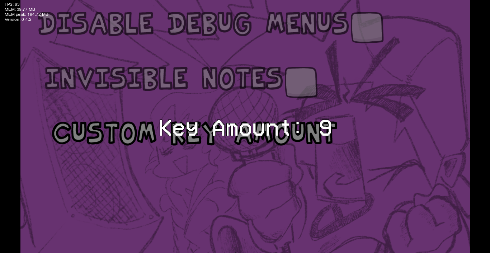
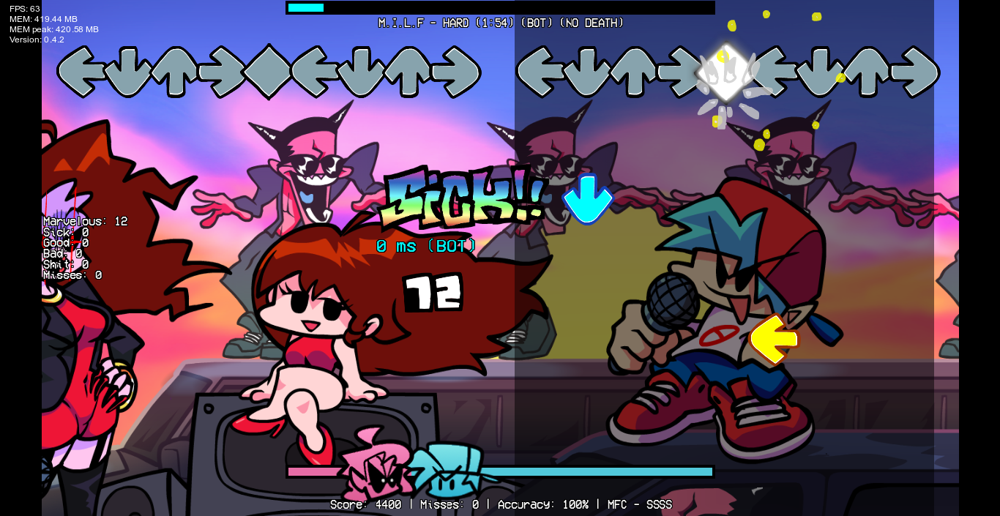
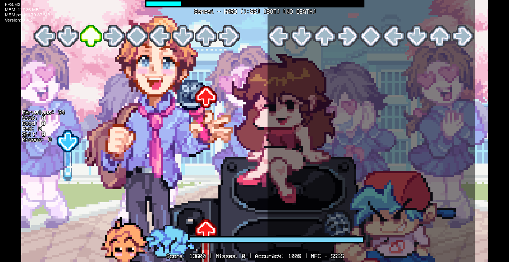

# Leather Engine - Mania Plus

This is a small modification of Leather Engine that adds a "Custom Key Amount" option, which lets you convert and play any song to any supported key amount (1K to 21K). Also includes some minor bugfixes.

The source code is based on Leather Engine v0.4.2 and uses the same library versions, so it should be compatible with the latest mods.

## How to use

The custom key amount option can be found in the "Misc" section in the options menu.

## Credits

* Leather128 - Creator of Leather Engine

* KadeDev - Code for downscroll & Modcharts

* SrPerez - Original 9 Key and 6 Key Designs

* larsiusprime - Scrollable Drop Down Menu

* PolybiusProxy - .mp4 Video Loader Extension

* datee - Developing HaxeVLC (all the contents in the 'vlc' folder belongs to datee).

* Video LAN Team - People who made VLC Media Player (the thing the game uses to play videos)

* Ronezkj15 - Some Ideas + New Leather Engine Logo

* ShadowMario - Color Swap Shader (for notes and stuffs) + some really weird modchart stuff that im too stupid to know lol

* Smokey555 - Adobe Animate Spritemap -> FlxFramesCollection Support

* Starmapo - Creator of this modification

* TheLeerName - [Mania converter algorithm](https://github.com/TheLeerName/mania-converter)
